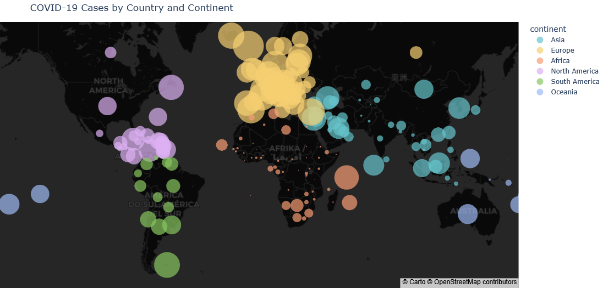

# COVID-19 Tracker Data Analysis
Final Project – Data Analysis Retraining Course

This repository contains a data analysis project based on a COVID-19 tracker dataset.
The analysis was created as the **final project for a Data Analysis retraining course**.

The project explores pandemic-related data using Python and visualizes key trends with both static and interactive charts.

## Project Overview

The goal of this project was to explore and analyze COVID-19 data in order to:

* understand trends in reported cases
* compare development across countries or regions
* create clear and informative data visualizations
* build a simple interactive dashboard

The analysis is implemented in a **Jupyter Notebook (.ipynb)**.

## Technologies Used

The project was developed in **Python** using the following libraries:

* **pandas** – data cleaning and analysis
* **seaborn** – statistical data visualization
* **matplotlib** – static plots and charts
* **plotly express** – interactive visualizations
* **Dash** – simple web dashboard
* **threading** – running the Dash app within the notebook

Additional tools used during development:

* **Google Colab**
* **Google Drive integration**

## Project Structure
```.
├── covid19_analysis.ipynb   # Main notebook with data analysis and visualizations
├── data/                    # (optional) dataset used in the analysis
├── images/                  # PNG graphs used in README
│   └── covid_chart.png      # Example COVID-19 chart
└── README.md                # Project description```

## Key Features

* Data cleaning and preprocessing
* Exploratory data analysis (EDA)
* Static visualizations using Matplotlib and Seaborn
* Interactive charts using Plotly
* A simple interactive dashboard built with Dash

## Example Analyses

The notebook includes analyses such as:

* development of COVID-19 cases over time
* comparison of cases between selected countries
* visualization of trends using line charts and heatmaps
* interactive exploration of data using Plotly

## Example Visualization


## How to Run the Project

1. Clone the repository

```bash
git clone https://github.com/yourusername/covid19-tracker-analysis.git
```

2. Open the notebook

You can run the project in:

* **Jupyter Notebook**
* **JupyterLab**
* **Google Colab**

3. Install required libraries if needed

```bash
pip install pandas seaborn matplotlib plotly dash
```

## Author

Created as a **final project for a Data Analysis retraining course**.

## License

This project is intended for educational and portfolio purposes.
